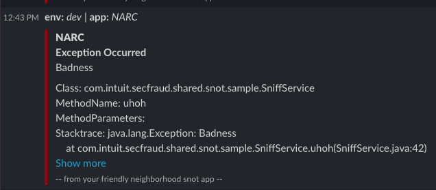
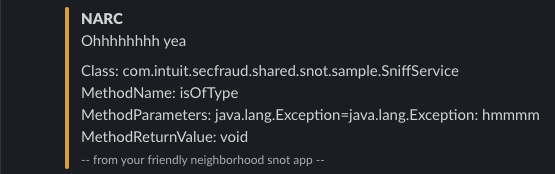

# SNOT
**SNOT** *Slack Notification* is a highly configurable Slack notification library that combines annotations and filters to send Slack messages using default or custom message templates ([Slack Template Builder](https://api.slack.com/block-kit)). Annotations can be at application or method levels and various strategies can be used to retrieve data from application or functions to build a context and provide to a template to generate a Slack notification.

# Javadoc

https://github.intuit.com/pages/secfraud-shared/snot/

# Quickstart
Add the following dependency to your pom.xml file:

```
<properties>
  <snot.version>1.0.32</snot.version>  <!-- or most current version -->
</properties>

<dependency>
  <groupId>com.intuit.secfraud.shared</groupId>
  <artifactId>snot</artifactId>
  <version>${snot.version}</version>
</dependency>
```

Add the following annotation to the root of your Spring Boot project (wherever @SpringBootApplication is used):

```
@Import(SnotConfiguration.class)
```

**Example**:

```
@SpringBootApplication
@EnableScheduling
@EnableAutoConfiguration
@Import(SnotConfiguration.class)
public class SherlockApplication {
    
    public static void main(final String[] args) {
        SpringApplication.run(SherlockApplication.class, args);
    }
}
```
* Annotate any method with @Snot and watch your SnotShot go!
* By default, this module is integrated with sandbox-intuit.slack.com. 
* Predefined channel demo-snot is used and the default behavior for Snot is to notify on exceptions thrown from the method.


**Annotations:**
@Snot : sends a message to list of targets

**Parameterized Annotations:**
* @SnotGot : filter for match on parameter or return type value.  toString() is used on object
* @SnotNot : filter for !match on parameter or return type value.  toString() is used on object 
* @SnotType : filter for match on parameter type

# Usage

```
# Example sending message when onNotify(...) method is invoked
 @Snot(message = "Quickbase fired webhook for created/updated case")
    public void onNotify(@Valid @RequestBody Pub1345Notify notify) {
        if (quickBaseService.validateUserToken(notify.getUserToken())) {
            quickBaseService.onNotify(notify.getCaseId());
        } else {
            LOGGER.warn("Invalid user token passed in from webook");
            throw new ResponseStatusException(HttpStatus.FORBIDDEN, "Invalid token");
        }
    }
    
# Example sending message when method throws Exception.  Note, no message is required in @Snot annotation.  targets are explicitly defined to "narc-errors"
  @Snot(targets = { "narc-errors" })
  public void executePub1345BulkReporting() {
      LOGGER.info("executing executePub1345BulkReporting");
      jobService.executePub1345BulkReporting();
  }

```
**Additional usage:**
@see [com.intuit.secfraud.shared.snot.sample](./src/main/java/com/intuit/secfraud/shared/snot/sample/SniffService.java)

# Result

**Exception**



**Debug**



**Message**


# Configuration
**Slack:**
* On-board your slack app client to slack https://api.slack.com/apps/
* Grant your all chat:write:bot permissions

**IDPS:**
Store your OAuth Access Token in IDPS

**Properties:**
Add the following spring configuration properties:

```
# Required properties:
snot.slack-app-oauth-token=your slack app oauth token

# Optional properties:

# application name
snot.app-name=your app name
# application link ( swagger page, or wiki )
snot.app-link=https://sherlock-be-blue.qa.api.intuit.com/v2/api-docs
# environment.  if not set, will try to use spring.profiles.active
snot.environment=dev
# slack default targets ( channels and users )  When explicit target list is not provided, defaults are used 
snot.slack-default-targets[0]=channel
snot.slack-default-targets[1]=@systemUser
# slack api post url hook.  This shouldn't need to be set, but just in case...defaults to https://slack.com/api/chat.postMessage 
snot.slack-app-url=https://slack.com/api/chat.postMessage
# debug
snot.debug=true
```
# Grollies

- @jingram1
- @gfuller1
- @jhermida

For help: go to #oifp-dev-snot


